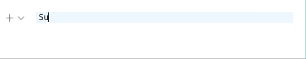

# Advanced Mathematica mode for CodeMirror 6
This is basically a fork built from the following repos
- [Legacy Modes](https://github.com/codemirror/legacy-modes) (Base)
- [Markword](https://github.com/fuermosi777/markword) (Widget functions)

## Key features
- highlight `7000` built-in symbols from Mathematica 13
- highlight user-defined symbols, if they are mentioned more than 1 time in the code
- syntax sugar for `Subscript`, `Superscript`



## Installation
Move the folder into your libs directory, and then

```js
import { StreamLanguage } from "@codemirror/language"
import { mathematica } from "./mathematica/mathematica"
import { mathematicaMath } from "./sugar/sugar";

const wolframlanguage = StreamLanguage.define(mathematica)

//....add to the extensions of your editor
      const editor = new EditorView({
        doc: /*.. */,
        extensions: [
        //.....
          wolframlanguage,
          mathematicaMath(),
        //.....
        ],
        parent: //...
      });

```

Have fun!
